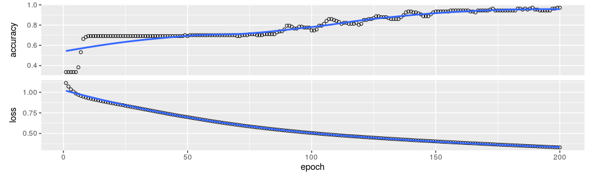
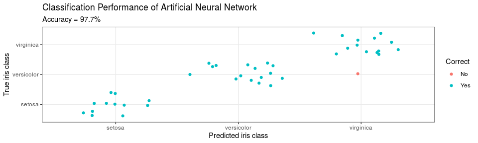

Hello Keras - A Simple Artificial Neural Network using Keras
================

## Task

*Copy relevant code from below to
[R/02\_hello\_keras.R](https://github.com/leonjessen/RPharma2019/blob/master/R/02_hello_keras.R)
and create a working model*

Note how this is now a 3-class classifier and we are evaluating the
predictive performance of the model on left out data.

### Introduction

The aim of this exercise is to let you build your first artificial
neural network using Keras. Naturally, we will use the `iris` data set.

### Load libraries

``` r
library('tidyverse')
library('keras')
```

### Data

[The famous Iris flower data
set](https://en.wikipedia.org/wiki/Iris_flower_data_set) contains data
to quantify the morphologic variation of Iris flowers of three related
species. In other words - A total of 150 observations of 4 input
features `Sepal.Length`, `Sepal.Width`, `Petal.Length` and `Petal.Width`
and 3 output classes `setosa` `versicolor` and `virginica`, with 50
observations in each class:

``` r
head(iris)
```

    ##   Sepal.Length Sepal.Width Petal.Length Petal.Width Species
    ## 1          5.1         3.5          1.4         0.2  setosa
    ## 2          4.9         3.0          1.4         0.2  setosa
    ## 3          4.7         3.2          1.3         0.2  setosa
    ## 4          4.6         3.1          1.5         0.2  setosa
    ## 5          5.0         3.6          1.4         0.2  setosa
    ## 6          5.4         3.9          1.7         0.4  setosa

### Aim

Our aim is to create a model, which connect the 4 input features
(`Sepal.Length`, `Sepal.Width`, `Petal.Length` and `Petal.Width`) to the
correct output class (`setosa` `versicolor` and `virginica`) using an
artificial neural network. For this task, we have chosen the following
simple architecture with one input layer with 4 neurons (one for each
feature), one hidden layer with 4 neurons and one output layer with 3
neurons (one for each class), all fully
connected:


Our artificial neural network will have a total of 35 parameters: 4 for
each input neuron connected to the hidden layer, plus an additional 4
for the associated first bias neuron and 3 for each of the hidden
neurons connected to the output layer, plus an additional 3 for the
associated second bias neuron. I.e. 4 x 4 + 4 + 4 x 3 + 3 = 35

### 1\. Prepare data

We start with slightly wrangling the iris data set by renaming the input
features and converting character labels to numeric:

``` r
nn_dat = iris %>% as_tibble %>%
  rename(sepal_l_feat = Sepal.Length,
         sepal_w_feat = Sepal.Width,
         petal_l_feat = Petal.Length,
         petal_w_feat = Petal.Width) %>%
  mutate(class_num = as.numeric(Species) - 1, # factor, so = 0, 1, 2
         class_label = Species)
nn_dat %>% head(3)
```

    ## # A tibble: 3 x 7
    ##   sepal_l_feat sepal_w_feat petal_l_feat petal_w_feat Species class_num
    ##          <dbl>        <dbl>        <dbl>        <dbl> <fct>       <dbl>
    ## 1          5.1          3.5          1.4          0.2 setosa          0
    ## 2          4.9          3            1.4          0.2 setosa          0
    ## 3          4.7          3.2          1.3          0.2 setosa          0
    ## # … with 1 more variable: class_label <fct>

Then, we split the iris data into a training and a test data set,
setting aside 20% of the data for left out data partition, to be used
for final performance evaluation:

``` r
test_f = 0.20
nn_dat = nn_dat %>%
  mutate(partition = sample(x = c('train','test'),
                            size = nrow(.),
                            replace = TRUE,
                            prob = c(1 - test_f, test_f)))
nn_dat %>% count(partition)
```

    ## # A tibble: 2 x 2
    ##   partition     n
    ##   <chr>     <int>
    ## 1 test         43
    ## 2 train       107

Based on the partition, we can now create training and test data

``` r
x_train = nn_dat %>%
  filter(partition == 'train') %>%
  select(contains("feat")) %>%
  as.matrix
y_train = nn_dat %>%
  filter(partition == 'train') %>%
  pull(class_num) %>%
  to_categorical(3)

x_test = nn_dat %>%
  filter(partition == 'test') %>%
  select(contains("feat")) %>%
  as.matrix
y_test = nn_dat %>%
  filter(partition == 'test') %>%
  pull(class_num) %>%
  to_categorical(3)
```

### 2\. Define model

Set architecture (See the green ANN visualisation)

``` r
model = keras_model_sequential() %>% 
  layer_dense(units = 4, activation = 'relu', input_shape = 4) %>% 
  layer_dense(units = 3, activation = 'softmax')
```

Compile model

``` r
model %>%
  compile(loss = 'categorical_crossentropy',
          optimizer = optimizer_rmsprop(),
          metrics = c('accuracy')
)
```

We can get a summary of the model like so:

``` r
model %>%
  summary
```

    ## ___________________________________________________________________________
    ## Layer (type)                     Output Shape                  Param #     
    ## ===========================================================================
    ## dense (Dense)                    (None, 4)                     20          
    ## ___________________________________________________________________________
    ## dense_1 (Dense)                  (None, 3)                     15          
    ## ===========================================================================
    ## Total params: 35
    ## Trainable params: 35
    ## Non-trainable params: 0
    ## ___________________________________________________________________________

As expected we see 35 trainable parameters.

### Train the Artificial Neural Network

Lastly we fit the model and save the training progres in the `history`
object:

``` r
history = model %>%
  fit(x = x_train,
      y = y_train,
      epochs = 200,
      batch_size = 20,
      validation_split = 0
)
```

Once the model is trained, we can inspect the training
process

``` r
plot(history)
```



### Evaluate Network Performance

The final performance can be obtained like so:

``` r
perf = model %>% evaluate(x_test, y_test)
perf
```

    ## $loss
    ## [1] 0.2103305
    ## 
    ## $acc
    ## [1] 0.9767442

Then we can augment the `nn_dat` for plotting:

``` r
plot_dat = nn_dat %>%
  filter(partition == 'test') %>%
  mutate(class_num = factor(class_num),
         y_pred = factor(predict_classes(model, x_test)),
         Correct = factor(ifelse(class_num == y_pred, "Yes", "No")))
plot_dat %>% select(-contains("feat")) %>% head(3)
```

    ## # A tibble: 3 x 6
    ##   Species class_num class_label partition y_pred Correct
    ##   <fct>   <fct>     <fct>       <chr>     <fct>  <fct>  
    ## 1 setosa  0         setosa      test      0      Yes    
    ## 2 setosa  0         setosa      test      0      Yes    
    ## 3 setosa  0         setosa      test      0      Yes

and lastly, we can visualise the confusion matrix like so:


### Conclusion

Here, we created a 3-class predictor with an accuracy of 97.7% on a left
out data partition. I hope, this illustrates how relatively simple it is
to get started with `Keras`.
